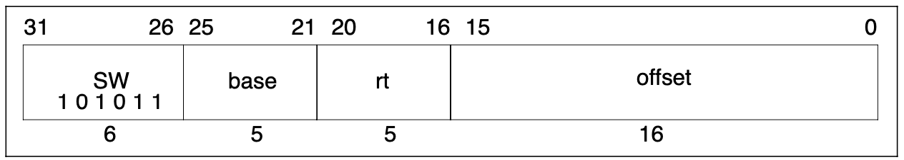

# Dynamic recompilation Part 6

## The Adventure Continues…

### Introduction
In this part we're going to start exploring how the MIPS family of Microprocessors
communicate with the outside world.

Up until now we've been recompiling operations that work entirely on registers, 
and now we turn our attention to the class of instructions that allow the processor
to interact with the system's memory.

We're going to start with the Store Word instruction which will allow us to 
store words in memory. This will allow us to explore how to handle functions 
that return values.

The MIPS family has other store instructions for other operand sizes (Half-word and byte) 
but the principles should hold for these variants.

### Recap

Last time we recompiled the **ADD** instruction while introducing the concept of
exception handling in the MIPS family of processors.

```c++
R3051 processor;
processor.WriteRegister(1, 0x40000000);
processor.WriteRegister(2, 0x40000000);
const uint32_t opcode = 0x00221820u; // ADD R3, R1, R2

CodeBuffer buffer(1024);

EmitterX64 emitter(buffer);
emitter.PushR64(RBP);
emitter.MovR64R64(RBP, RSP);

EmitAdd(emitter, processor, opcode)
  
emitter.MovR64R64(RSP, RBP);
emitter.PopR64(RBP);
emitter.Ret();

buffer.Protect();
buffer.Call();
```

We introduced the concepts of **Jumps** and **Labels** to our **Emitter** and
provided a means by which we can skip over short segments of recompiled code.

### I am altering the deal. Pray I don't alter it any further.
Let's introduce a function called StoreWord to be able to store a word to memory.

There a number of features to note about this function.

1. The second argument is a Virtual Address. When a program or process is 
executing in a multitasking environment things are arranged in such a way so that 
the program thinks it's the only program running and that it has access to a contiguous 
block of memory. The reality might be entirely different and behind the scenes the 
processor may be accessing non-contiguous blocks of memory. The task of mapping from a 
Virtual Address to a Physical Address (i.e. a real one) is normally handled by Coprocessor 0.
2. As the chipset evolved members of the MIPS family handled this task in different ways. 
The more expensive models within a revision used something called a Translation Look-aside 
Buffer (TLB for short) to do the translation and the cheaper ones used a static, 
or fixed mapping. Since implementing a TLB is a task in and of itself we elide the 
translation process here and assume the existence of the necessary functions at a later date.
3. The method returns a bool. This is to signal to the caller if the store operation 
was successful or not. The function could fail for any number of reasons, 
from an exception raised by the Address Translation itself, to the processor attempting
to write to a region of memory when it doesn't have sufficient privileges to do so. 
It is also assumed that, for now, this method does the exception handling on 
behalf of the caller.

The SW instruction is an I-Type instruction with its fields laid out as follows



An implementation for the interpreter might look as follows

using the InstructionImmediateExtended function we wrote for **ADDIU** to extend the offset.

It ignores the returned value from StoreWord since in the case of failure the Program Counter 
is now pointing to one of the Exception Vectors and the next pass of the interpreter loop 
will resume execution from that point.

### This deal's getting worse all the time
The task for the recompiled version is to exit from the recompiled function when a problem 
arises with StoreWord much like the **ADD** instruction in the previous part.

Let's introduce a new helper function CallStoreWord, which when given the parameters extracted from the function, will emit a call to the underlying StoreWord function.

Unlike all the previous interpreter functions we've called StoreWord takes not 2, but 3 arguments. 
Consulting the System V AMD64 ABI we learn that the third argument is to be passed in the RDX register.

The address of the processor is to be stored in RDI; the virtual address computed in RSI and the 
value we want to store in RDX.

There's a small amount register reuse here. We initially use RDX to store the address of MIPS register R0 
but immediately prior to the call we update it with the contents of MIPS register Rt.

The outline for the recompiled version of is then as follows

First, in case any exception occurs during StoreWord, it updates the interpreter's copy of the Program Counter by calling WritePC. This is pre-emptive since any exception handling during StoreWord is going to be done by the interpreter functions.

After we call StoreWord, we need to determine if an exception occurred, so we can return from the recompiled function. How do we do this?

The System V AMD64 ABI says that functions put their return values in RAX. Functions returning a boolean value like StoreWord place 1 in RAX to represent true and 0 to represent false.

The task is to determine if RAX contains 0 or 1. Two instructions can help us here

Test AL, Imm8 logically ANDs the contents of the immediate 8-bit value and the lower 8-bits of the RAX register and sets the Zero flag when the result is zero and clears it otherwise.
Jne/Jnz, or Jump Not Equal/Non-Zero, jumps to the target when the Zero flag is clear.

If we test RAX with 1 and the Zero flag is clear (i.e. the result was non-zero) then we want to continue with the execution, otherwise we want to stop.
After consulting the Intel Reference Manual let's build upon our previous work by adding two more functions to our Emitter.

Note that the Jne and Jno functions in our Emitter since they are virtually identical, but I am choosing to live with a small amount of repetition for didactic purposes.
Finally, we can put this all together to get

to conclude our discussion of the SW instruction.

### Conclusion
In this article we discussed how one might go about implementing the store family of MIPS instructions. As a consequence, our processor implementation can now write to external Memory and Memory Mapped Devices.

Along the way we learned how to pass a 3rd argument to an interpreter function and how to process function return values as specified by the System V AMD64 ABI.

In the next part, we'll finally try to load values from memory by implementing the LW or Load Word instruction. In order to do this we'll have to introduce the concepts of delay-slots and Pipeline Hazards.

### References
Intel Software Developer's Manual