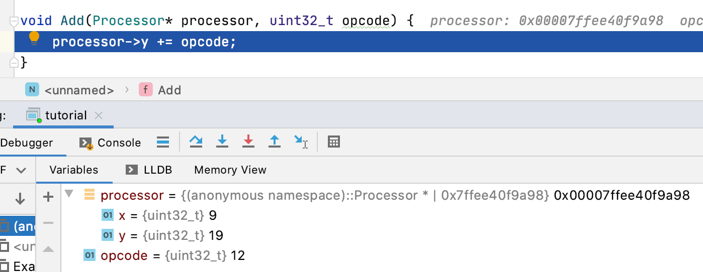
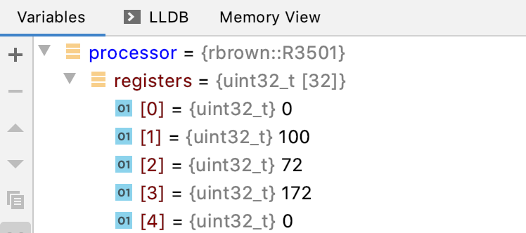

# Dynamic recompilation Part 3
## Just when you thought it was safe to go back in the water.

### Introduction
In this part we're going to go a little deeper into the
System V AMD64 Calling Conventions[^1] and how we might
use that to pass arguments to our functions.

There will be our first detour into what a MIPS processor 
and its instruction set looks like.

We'll then use this knowledge to actually Interpreter functions
to make our recompiler a little more functional.

### Recap
Last time we got as far as calling a no-argument void 
returning function following stack frame conventions

```c++
void HelloWorld() {
    std::cout << "hello world" << std::endl;
}

CodeBuffer buffer(1024);

EmitterX64 emitter(buffer);
emitter.PushR64(RBP);
emitter.MovR64R64(RBP, RSP);

emitter.Call(AddressOf(HelloWorld));

emitter.MovR64R64(RSP, RBP);
emitter.PopR64(RBP);
emitter.Ret();

buffer.Protect();
buffer.Call();
```

and while this fantastic we can't pass any arguments
and make the function do any work related to the context
it's being called from. Let's see if we can improve this state of affairs.

### Convention Matters
The goal of this section is to enable us to call functions like these

```c++
struct Processor {
    uint32_t x;
    uint32_t y;
};

void Add(Processor* processor, uint32_t opcode) {
    processor->y += opcode;
}
```

from our recompiled code. The choice of method signature here allows us, given some object
representing the Guest Processor state and an Operation Code, to be able to apply the relevant operation to it. 

For writing a really super optimised Dynamic Recompiler this may not be the best choice, 
but it will allow us to evolve our MIPS interpreter into a recompiler relatively easily.

So how do we pass arguments to a function?

The x86-64 processors have 16 integer registers at their disposal; **RAX**, **RCX**, **RDX**, **RBX**
(it looks like someone at Intel decided to reorder the alphabet), **RSP**, **RBP**, **RSI**, **RDI** and 
**R8** through to **R15**. Most of these are general purpose but as we saw in the previous 
parts **RSP** and **RBP** in particular are used to manage the stack.

The System V AMD64 ABI calling convention says that we can use 
**RDI**, **RSI**, **RDX**, **RCX**, **R8** and **R9** to pass the first 6 integer arguments in that 
order (and this includes pointers) to a function. Windows, of course, uses a 
different convention and says you can pass the first 4 integer arguments 
into **RCX**, **RDX**, **R8**, and **R9**. There's also a convention for floating point 
arguments but since the MIPS processor can by itself can only handle integer 
values we'll not discuss this here.

To try and keep the code eventually portable let's not pass more 4 arguments to a function.

Before proceeding, it's also worth mentioning something about how the 
convention dictates we can use registers within functions. The registers can 
be divided into two categories; those you can use with impunity and those you can use,
but you need to be a little more careful with.

The ones you can use with impunity are called _scratch_, _volatile_ or _Caller-saved_ registers.
The System V AMD64 calling convention says that those are **RAX**, **RDI**, **RSI**, **RDX**, **RCX**, **R8-R11**.
It's up to the function calling you (i.e. the Caller) to stack or save these values if it needs them.

The ones you have to treat more carefully are called _non-volatile_ or _Callee-saved_ registers.
You can use them, but you should stack or save them before using them and unstack or restore 
them before returning from your function. They are, in the given convention, **RBX**, **RSP**, **RBP**,
**R12-15**. It's probably not surprising that the two registers used to manage the stack are in this list.

Back to the task at hand.

We have a two argument function, so we're going to need to use **RDI** and **RSI** 
to pass those arguments. In **RDI** we're going to want to place the 64-bit address 
of the Processor struct and in the lower 32-bits of **RSI** (referred to as **ESI**)
the 32-bit opcode.

```c++
struct Processor {
    uint32_t x;
    uint32_t y;
};

void Add(Processor* processor, uint32_t opcode) {
    processor->y += opcode;
}

Processor processor { 9, 19 };
const uint32_t opcode = 12;

CodeBuffer buffer(1024);

EmitterX64 emitter(buffer);
emitter.PushR64(RBP);
emitter.MovR64R64(RBP, RSP);

// MOV RDI, AddressOf(processor);
// MOV ESI, opcode
emitter.Call(AddressOf(Add));

emitter.MovR64R64(RSP, RBP);
emitter.PopR64(RBP);
emitter.Ret();
```

At this point we consult the instruction set references[^2][^3] and discover that
we can achieve this with the help of two further additions to our **Emitter**. Firstly,

```c++
void EmitterX64::MovR64Imm64(uint32_t rw, uint64_t imm64) {
    // MOV rw, imm64
    const uint8_t rex = Rex(1, 0, 0, rw >> 3u);
    const uint8_t code = 0xB8u + (rw & 7u);
    buffer.Bytes({ rex, code });
    buffer.QWord(imm64);
}
```

which outputs a **REX.W** prefix, the register based opcode and finally the 64-bit 
immediate quantity itself. Then secondly,

```c++
void EmitterX64::MovR32Imm32(uint32_t rw, uint32_t imm32) {
    // MOV rw, imm32
    const uint8_t rex = Rex(0, 0, 0, rw >> 3u);
    const uint8_t code = 0xB8u + (rw & 7u);
    buffer.Bytes({ rex, code });
    buffer.DWord(imm32);
}
```

which does something very similar but with a 32-bit quantity.

One small further digression at this point. For this series of articles we're always
going to write out the **REX** prefix. In some cases, such as in the **MovR32Imm32** method above, 
if we're performing a 32-bit operation on a register that can be encoded into 3-bits 
(**RBX** for example) then we don't need to output the **REX** prefix at all. However, we elect to 
keep the code snippets short.

Our code now becomes

```c++
Processor processor { 9, 19 };
const uint32_t opcode = 12u;

CodeBuffer buffer(1024);

EmitterX64 emitter(buffer);
emitter.PushR64(RBP);
emitter.MovR64R64(RBP, RSP);

emitter.MovR64Imm64(RDI, AddressOf(processor));
emitter.MovR32Imm32(RSI, opcode);
emitter.Call(AddressOf(Add));

emitter.MovR64R64(RSP, RBP);
emitter.PopR64(RBP);
emitter.Ret();

buffer.Protect();
buffer.Call();
```

and the result should be something like



meaning that we've been able to call a function with the processor state set out in 
the code above with the desired arguments. That's pretty amazing!

### If you build it, Linus Torvalds won't use it
Before going any further we now have to talk about the MIPS architecture and family of processors.
MIPS processors could be found in a number of late 1990s and early 2000s games consoles 
(Playstation 1, Playstation 2 and N64) and Silicon Graphics Workstations, but they eventually 
were replaced by PowerPC and later Intel processors in domestic applications.

This state of affairs is contrary to the expectations of certain noted computer 
scientists who thought that MIPS would be the dominant player.
See [here][torvalds-tannenbaum] for the context.

The MIPS processors are RISC processors. This means that in comparison say to the
Intel x86 family they have a considerably smaller number of instructions. The instructions 
are all 32-bits wide and have much greater uniformity in their encoding. 
Nothing similar to **REX**, **ModR/M** and **SIB** here.

The MIPS processors are also what are called Load-Store Architectures. 
All ALU operations, Addition and Subtraction for example, target registers 
and not memory. If you want to modify a memory location you first have to 
load its contents into a register, operate upon it and then store the result in memory. 
This means that in comparison to their CISC contemporaries the MIPS processors 
had a large number of registers, 32 to be precise, to avoid moving values continuously in and out of memory.

Let's begin by providing a simple implementation of a MIPS processor

```c++
class R3051 {
public:
    R3051();
    uint32_t ReadRegister(uint32_t) const;
    void WriteRegister(uint32_t, uint32_t);
private:
    uint32_t registers[32];
};
```

the constructor zeroes the register array and the **ReadRegister** and **WriteRegister**
function hopefully as one would expect.

The **ADDU** instruction

```asm
ADDU Rd, Rs, Rt
```

is encoded as a _Register-Type_ or _R-Type_ instruction. Its fields are laid is as follows


with the top 6 bits indicating that this is a special function and the lower 6 bits indicating
that this is an unsigned addition operation.

It adds **Rs** and **Rt** as unsigned quantities and storing the result in **Rd**.
This can be implemented this as

```c++
void InterpretAddu(R3051* r3051, uint32_t opcode) {
    const uint32_t s = ReadRegisterRs(r3051, opcode);
    const uint32_t t = ReadRegisterRt(r3051, opcode);
    WriteRegisterRd(r3051, opcode, s + t);
}
```

The **ReadRegisterRx** and **WriteRegisterRx** functions in the above are convenience
functions for extracting the **Rx** field from the opcode and then reading from or 
writing to the appropriate register in our **R3051** object.

One thing to be mindful of here is that the MIPS register **R0** is always zero.
Writing to it has no effect. This is left as an exercise to the reader.

We'll begin by adding the following helper function to allow us to call Interpreter functions

```c++
void CallInterpreterFunction(EmitterX64 &emitter, uintptr_t function, R3051 &processor, uint32_t opcode) {
    emitter.MovR64Imm64(RDI, AddressOf(processor));
    emitter.MovR32Imm32(RSI, opcode);
    emitter.Call(function);
}
```

This puts the address of the Processor into **RDI**, 
the Operation Code into the lower 32-bits of **RSI** 
and then calls the function at the supplied address.
For now, it also maintains the necessary stack alignment.

We can then put this all together to write some code that will actually execute a MIPS instruction

```c++
R3051 processor;
processor.WriteRegister(1, 100);
processor.WriteRegister(2, 72);
const uint32_t opcode = 0x00221821u; // ADDU R3, R1, R2

CodeBuffer buffer(1024);

EmitterX64 emitter(buffer);
emitter.PushR64(RBP);
emitter.MovR64R64(RBP, RSP);

CallInterpreterFunction(emitter, AddressOf(InterpretAddu), processor, opcode);

emitter.MovR64R64(RSP, RBP);
emitter.PopR64(RBP);
emitter.Ret();

buffer.Protect();
buffer.Call();
```

Stepping into the disassembly we have that

```text
->  0x104769000: pushq  %rbp
0x104769002: movq   %rsp, %rbp
0x104769005: movabsq $0x7ffeeb4f0870, %rdi
0x10476900f: movl   $0x221821, %esi
0x104769015: callq  0x104717540 ; InterpretAddu
0x10476901a: movq   %rbp, %rsp
0x10476901d: popq   %rbp
0x10476901f: retq
```
and the result of executing the code is



as one would hope.

One thing to keep in mind is that this approach loads the address of the
Processor into **RDI** each and every time we want to make call. The address of the Processor
never changes during the recompilation and since most likely in the given set-up we're going
to want to call the Interpreter functions quite often we could perhaps permanently
store the address of the Processor in some register to speed things up.

### Conclusion
In this article we discussed what is required to be able to pass arguments
to a function so that our Dynamic Recompiler can fall back to an Interpreted implementation.

We also discussed the conventions around how registers are used in x86–64
not only for passing arguments to functions but how our recompiled functions
can use those registers safely.

The MIPS architecture was introduced and an instruction was implemented.

In the next part we'll set about reimplementing the **ADDU** instruction without
having to fall back to Interpreter function. We'll also make implementation more
versatile and support the **SUBU** and **ADDIU** instructions.

### References

[^1]: [System V AMD64 ABI Calling Convention][wikipedia-system-v-amd64-abi]
[^2]: [Intel Software Developer's Manual][intel-reference-manual]
[^3]: [Felix Cloutier's Intel Online Reference][intel-online-reference-cloutier]

[wikipedia-system-v-amd64-abi]: https://en.wikipedia.org/wiki/X86_calling_conventions#System_V_AMD64_ABI
[torvalds-tannenbaum]: https://en.wikipedia.org/wiki/Tanenbaum–Torvalds_debate
[intel-reference-manual]: https://software.intel.com/content/www/us/en/develop/download/intel-64-and-ia-32-architectures-sdm-combined-volumes-1-2a-2b-2c-2d-3a-3b-3c-3d-and-4.html
[intel-online-reference-cloutier]: https://www.felixcloutier.com/x86/
