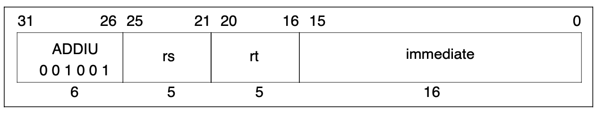

# Dynamic recompilation Part 4
## If at first you don't succeed, lower your standards.

### Introduction
In this part we're actually going to recompile three MIPS instructions; **ADDU**, **SUBU** and **ADDIU**.

We're going to discuss a couple of basic techniques for achieving this and then discuss why
they're both suboptimal and how, if we were writing something a bit more advanced, we could do better.

### Recap
Last time we got as far as being able to fall back to calling a corresponding Interpreter function

```c++
R3051 processor;
processor.WriteRegister(1, 100);
processor.WriteRegister(2, 72);
const uint32_t opcode = 0x00221821u; // ADDU R3, R1, R2

CodeBuffer buffer(1024);

EmitterX64 emitter(buffer);
emitter.PushR64(RBP);
emitter.MovR64R64(RBP, RSP);

CallInterpreterFunction(emitter, AddressOf(InterpretAddu), processor, opcode);

emitter.MovR64R64(RSP, RBP);
emitter.PopR64(RBP);
emitter.Ret();

buffer.Protect();
buffer.Call();
```

which means that we've pretty much reached that standard necessary for a _Threaded Interpreter_.

So that we don't have to keep referring back to the previous part we'll also restate the instruction
encoding for **ADDU**.


### Lost in Translation
There's nothing wrong with what we just did, but it means that there's still a fair
amount of overhead for each single instruction. The emitted **CALLs** will result in extra 
stack manipulations and the Interpreted functions themselves will do redundant work decoding
the constant instruction fields each and every time.

For simple instructions like **ADDU** we can eliminate both forms of overhead.

At recompile time we can already deduce the values of **Rs**, **Rt** and **Rd** with
the help of the functions

```c++
uint32_t InstructionRd(uint32_t);
uint32_t InstructionRt(uint32_t);
uint32_t InstructionRs(uint32_t);
```

What we are currently lacking however are a couple of abstractions in our **Emitter** 
that would let us achieve something like

```asm
MOV RAX, MIPS register Rs
MOV RCX, MIPS register Rt
ADD RAX, RCX
MOV MIPS register Rd, RAX
```

that is to say the ability to load a MIPS Guest Register into an x86–64 Host Register and vice-versa.

We start with observation that if we know the address of a Guest Register in memory then
we can load it into a Host Register with a Move instruction.

Let's add the following method to our **R3051** class

```c++
uintptr_t RegisterAddress(uint32_t) const;
```

which will allow us, given a register number, to return the address of that register in memory.
Its implementation for now is as follows

```c++
uintptr_t R3051::RegisterAddress(uint32_t r) const {
    return reinterpret_cast<uintptr_t>(&registers[r]);
}
```

Now that we know how to get the address of a Guest Register in memory we would like to be able 
to transfer it to and from a Host Register. Consulting the Intel Software Developer's Manual[^1][^2]
gives us two plausible options for a naive implementation:

```asm
MOV EAX,moffs32* ; (A1)
MOV moffs32*,EAX ; (A3)
```

Note that we're only interested in loading 32-bit quantities to and from **RAX** since the MIPS registers 
themselves are 32-bit. So let's add these two functions to our **Emitter**.

```c++
void EmitterX64::MovEAXAbs(uintptr_t address) {
    // MOV eax, address
    buffer.Byte(0xA1u);
    buffer.QWord(address);
}

void EmitterX64::MovAbsEAX(uintptr_t address) {
    // MOV address, EAX
    buffer.Byte(0xA3u);
    buffer.QWord(address);
}
```

There is just one problem with this approach in that we can only move data in and out of **RAX**.
If you recall in the above assembly outline we wanted to load one of the operands into **RCX**,
so we're also going to need the ability to move quantities between Host Registers.

After further consultation of the Intel manual we can arrive at

```c++
void EmitterX64::MovR32R32(uint32_t rm, uint32_t reg) {
    // MOV rm, reg
    const uint8_t rex = Rex(0, reg >> 3u, 0, rm >> 3u);
    const uint8_t mod = ModRM(3u, reg, rm);
    buffer.Bytes({ rex, 0x89u, mod });
}
```

which will let us move 32-bit quantities around between the Host Registers
(in this case from **RAX** to **RCX**).

Of course, we would like to be able to Add our two 32-bit values together, so we will need to emit the 
actual **Add** instructions on the Host

```c++
void EmitterX64::AddR32R32(uint32_t rm, uint32_t reg) {
    // ADD rm, reg
    const uint8_t rex = Rex(0, reg >> 3u, 0, rm >> 3u);
    const uint8_t mod = ModRM(3u, reg, rm);
    buffer.Bytes({ rex, 0x01u, mod });
}
```

Putting this all together we get

```c++
void EmitAddu(EmitterX64& emitter, R3051& processor, uint32_t opcode) {
    // Rd = Rs + Rt
    const uint32_t rs = InstructionRs(opcode);
    const uint32_t rt = InstructionRt(opcode);
    const uint32_t rd = InstructionRd(opcode);
    emitter.MovEAXAbs(processor.RegisterAddress(rs));
    emitter.MovR32R32(RCX, RAX);
    emitter.MovEAXAbs(processor.RegisterAddress(rt));
    emitter.AddR32R32(RAX, RCX);
    emitter.MovAbsEAX(processor.RegisterAddress(rd));
}

R3051 processor;
processor.WriteRegister(1, 100);
processor.WriteRegister(2, 72);
const uint32_t opcode = 0x00221821u; // ADDU R3, R1, R2

CodeBuffer buffer(1024);

EmitterX64 emitter(buffer);
EmitAddu(emitter, processor, opcode);
emitter.Ret();

buffer.Protect();
buffer.Call();
```

Again we can verify this works with some help from our IDE


but what's of greater interest is the disassembly

```text
->  0x10f37000c: movabsl 0x7ffee08afa24, %eax
0x10f370015: movl   %eax, %ecx
0x10f370018: movabsl 0x7ffee08afa28, %eax
0x10f370021: addl   %ecx, %eax
0x10f370024: movabsl %eax, 0x7ffee08afa2c
0x10f37002d: ...
```

which is more-or-less what we expect, but we should draw our attention to the fact that each of those 
**MOVABSL** instructions is 9 bytes long and the entire segment is 33 bytes long.

Let's see if we can do better in the next section.

### Relatively Speaking
Up until this point we've been using **Absolute Addressing**, that is to say we know absolutely
where each individual Guest Register is in memory and leveraged this information to write our 
Dynamic Recompiler.

There is however another form of addressing called _Register Indirect_ with Displacement 
supported by x86–64 processors which might help us produce shorter code.

_Register Indirect with Displacement_ addressing works by taking the value stored in a register,
adding a displacement to that value, and then using the result to form an address with which to
either read from or write to memory.

To make the example more concrete we have, in Intel syntax, the following instruction

```asm
MOV EAX, DWORD PTR [R9 + 12]
```

which says _"Load the 32-bit quantity (signified by DWORD) at the location in memory addressed
by the value in R9 plus 12 into EAX"_.

That's nice but how does this help?

Well, our Guest Registers are represented in our **R3051** class as an array. This means that the
registers are stored contiguously in memory. The first 4 bytes represent the first Guest Register,
the next 4 the second Guest Register and so on. Therefore, if we know the _Absolute Address_ of the
first Guest Register then we know the addresses of all the other Guest Registers relative to the first.

We can use this relative location together with _Register Indirect with Displacement_ addressing to
produce shorter code.

In order to be able to use this form of addressing we're going to have to revisit our friend
the **ModR/M** byte. Let's restate its definition here.

| 7 6 | 5 4 3 | 2 1 0 |
|-----|-------|-------|
| mod | reg   | rm    |

So far, we've been setting both **mod** bits to **1**. In most cases, this tells the processor that the 
**mod** and **rm** fields represent registers directly.

However, when we set the **mod** bits to something other than both **1** then the processor 
interprets the meanings of the **mod** and **rm** fields differently[^3]. When **mod** is

- **00** we're telling the processor to use the value in the **rm** register indirectly as an address.
- **01** we're telling the processor to use the value in the **rm** register with a signed 8-bit displacement indirectly as an address.
- **10** we're telling the processor to use the value in the **rm** register with a signed 32-bit displacement indirectly as an address.

_**Note**: This isn't the entire story. When **rm** is one of **RSP**, **RBP**, **R12** or 
**R13** then the processor will use different forms of addressing. Use with care!_

Which value of **mod** do we want to use?

It turns out that our Guest Register array in the **R3051** class is 128 bytes long and that the 
last Guest Register is 124 bytes away from the first. 124 can be represented by a signed 8-bit quantity,
so we want to use **01**. Knowing this we can now introduce the following two methods to our **Emitter** class

```c++
void EmitterX64::MovR32Disp8(uint32_t reg, uint32_t rm, uint8_t disp8) {
    // MOV reg, DWORD PTR [rm + disp8]
    const uint8_t rex = Rex(0, reg >> 3u, 0, rm >> 3u);
    const uint8_t mod = ModRM(1u, reg, rm);
    buffer.Bytes({ rex, 0x8Bu, mod, disp8 });
}
```

and

```c++
void EmitterX64::MovDisp8R32(uint32_t rm, uint8_t disp8, uint32_t reg) {
    // MOV DWORD PTR [rm + disp8], reg
    const uint8_t rex = Rex(0, reg >> 3u, 0, rm >> 3u);
    const uint8_t mod = ModRM(1u, reg, rm);
    buffer.Bytes({ rex, 0x89u, mod, disp8 });
}
```

to move 32-bit quantities in and out of registers respectively.

We can now put this all together to get

```c++
void EmitAddu(EmitterX64& emitter, R3051& processor, uint32_t opcode) {
    // Rd = Rs + Rt
    const uint32_t rs = InstructionRs(opcode);
    const uint32_t rt = InstructionRt(opcode);
    const uint32_t rd = InstructionRd(opcode);
    const size_t size = sizeof(uint32_t);
    emitter.MovR64Imm64(RDX, processor.RegisterAddress(0));
    emitter.MovR32Disp8(RAX, RDX, rs * size);
    emitter.MovR32Disp8(RCX, RDX, rt * size);
    emitter.AddR32R32(RAX, RCX);
    emitter.MovDisp8R32(RDX, rd * size, RAX);
}

R3051 processor;
processor.WriteRegister(1, 100);
processor.WriteRegister(2, 72);
const uint32_t opcode = 0x00221821u; // ADDU R3, R1, R2

CodeBuffer buffer(1024);

EmitterX64 emitter(buffer);
emitter.PushR64(RBP);
emitter.MovR64R64(RBP, RSP);

EmitAddu(emitter, processor, opcode);

emitter.MovR64R64(RSP, RBP);
emitter.PopR64(RBP);
emitter.Ret();

buffer.Protect();
buffer.Call();
```

The important line is

```c++
emitter.MovR64Imm64(RDX, processor.RegisterAddress(0));
```

which moves the address of the first Guest Register into the _scratch_ register **RDX** so 
that it can be used as a _base register_ for computing the relative addresses of the Guest Registers.

Let's look at the disassembly

```text
->  0x10e71000a: movabsq $0x7ffee150fa20, %rdx
0x10e710014: movl   0x4(%rdx), %eax
0x10e710018: movl   0x8(%rdx), %ecx
0x10e71001c: addl   %ecx, %eax
0x10e71001f: movl   %eax, 0xc(%rdx)
0x10e710023: ...
```

This segment is 25 bytes long and while that doesn't look like that much of an initial saving at first,
if we were to store the address of the first Guest Register permanently in **RDX** across multiple **ADDU** 
instructions then we would only emit 15 bytes per instruction.

That's quite an improvement!

### Just Keep Swimming
We have thus far been focusing on getting something that works. But there are some obvious drawbacks
that should be pointed out.

Consider the MIPS instruction

```asm
ADDU R1, R3, R3
```

As it stands our recompiler will fetch the Guest Register **R3** from memory twice. This is unnecessary work.
We could fix this by making our **EmitAddu** function a bit smarter but that won't address this second case

```asm
ADDU R1, R3, R4
ADDU R2, R3, R4
```

Again, the example is a little contrived, but across the two instructions we will fetch Guest Registers 
**R3** and **R4** from memory twice in very short succession when we could have done better to have held those 
values in Host Registers. Our recompiler is very forgetful.

To combat this forgetfulness, how about we store all the MIPS registers in the x86–64 registers instead?
Do we really need to do all this extra work?

Well the problem with this approach is that MIPS processors have 32 registers
and x86–64 processors have 16 registers. We simply _can't_ keep all the Guest Registers 
in Host Registers the entire time.

This problem is called Register Allocation[^4] and would be worthy of its own series of 
articles. For now, we'll continue with our forgetful approach because there are other things 
related to the MIPS family that need to be covered before going for the bells and whistles.

### The Others
In this final section we'll cover the two other MIPS instructions **SUBU** and **ADDIU**.

**SUBU** should now offer little in the way of surprises. We can use most of the heavy lifting 
we did for **ADDU**. We'll need a way to tell the Host Processor to subtract two 32-bit registers 
from one another. We can extend the **Emitter** class further with

```c++
void EmitterX64::SubR32R32(uint32_t rm, uint32_t reg) {
    // SUB rm, reg
    const uint8_t rex = Rex(0, reg >> 3u, 0, rm >> 3u);
    const uint8_t mod = ModRM(3u, reg, rm);
    buffer.Bytes({ rex, 0x29u, mod });
}
```

Our **EmitSubu** method would look something like

```c++
void EmitSubu(EmitterX64& emitter, R3051& processor, uint32_t opcode) {
    // Rd = Rs - Rt
    const uint32_t rs = InstructionRs(opcode);
    const uint32_t rt = InstructionRt(opcode);
    const uint32_t rd = InstructionRd(opcode);
    const size_t size = sizeof(uint32_t);
    emitter.MovR64Imm64(RDX, processor.RegisterAddress(0));
    emitter.MovR32Disp8(RAX, RDX, rs * size);
    emitter.MovR32Disp8(RCX, RDX, rt * size);
    emitter.SubR32R32(RAX, RCX);
    emitter.MovDisp8R32(RDX, rd * size, RAX);
}
```

**ADDIU** requires a little more thought. It's a MIPS _I-Type_ instruction and its encoding looks like this



it operates by sign extending[^5] the immediate field to 32-bits and adding it to the value in **Rs** 
then storing the result in **Rt**.

The reason that this requires a little more thought is that x86–64 processors only really support 
8-bit and 32-bit immediate values. They have an Operand Size Override Prefix (**0x66u**) to let you use
16-bit immediate values but the consensus appears to be that we should avoid using it.

At recompile time we can sign extend the constant immediate value to 32-bits ourselves with 
the help of this function.

```c++
uint32_t InstructionImmediateExtended(uint32_t);
```

Next, we want to be able to add a 32-bit immediate quantity to a 32-bit register. Consulting 
the Intel manual once more we can then extend our Emitter with

```c++
void EmitterX64::AddR32Imm32(uint32_t rm, uint32_t imm32) {
    // ADD rm, imm32
    const uint8_t rex = Rex(0, 0, 0, rm >> 3u);
    const uint8_t mod = ModRM(3u, 0, rm);
    buffer.Bytes({ rex, 0x81u, mod });
    buffer.DWord(imm32);
}
```

The **EmitAddiu** function would then look like

```c++
void EmitAddiu(EmitterX64& emitter, R3051& processor, uint32_t opcode) {
    // Rt = Rs + Imm
    const uint32_t rs = InstructionRs(opcode);
    const uint32_t rt = InstructionRt(opcode);
    const uint32_t immediate = InstructionImmediateExtended(opcode);
    const size_t size = sizeof(uint32_t);
    emitter.MovR64Imm64(RDX, processor.RegisterAddress(0));
    emitter.MovR32Disp8(RAX, RDX, rs * size);
    emitter.AddR32Imm32(RAX, immediate);
    emitter.MovDisp8R32(RDX, rt * size, RAX);
}
```

which loads **Rs** into **RAX** and then adds the immediate sign extended quantity to it.

Now that we can finally recompile more than one type of instruction it would be perhaps 
helpful to have a function like

```c++
void Emit(EmitterX64& emitter, R3051& processor, uint32_t opcode) {
    switch (InstructionOp(opcode)) {
        case 0x00: switch(InstructionFunction(opcode)) {
                case 0x21: return EmitAddu(emitter, processor, opcode);
                case 0x23: return EmitSubu(emitter, processor, opcode);
                default:
                    break;
            }
        case 0x09: return EmitAddiu(emitter, processor, opcode);
        default:
            break;
    }
}
```

to decode the instruction types and dispatch them to the appropriate recompilation method.
This looks very much like the interpreter loop we presented all the way back in
[Part 1](./part-01-0.md#what-is-dynamic-recompilation).

### Conclusion
In this article we implemented two versions of the **ADDU** instruction and discussed their shortcomings.

We also drew attention to the fact that our naive and somewhat forgetful implementation 
could be improved upon by using _Register Allocation_.

Finally, we implemented two other instructions **SUBU** and **ADDIU** by building upon what we learned.

In the next part we'll implement the **ADD** instruction and talk about MIPS exceptions.

### References
[^1]: [Intel Software Developer's Manual][intel-reference-manual]
[^2]: [Felix Cloutier's Intel Online Reference][intel-online-reference-cloutier]
[^3]: [OS Dev Wiki-32/64-bit addressing][os-dev-wiki-32-64-bit-addressing]
[^4]: [Wikipedia article on Register Allocation][wikipedia-register-allocation]
[^5]: [Wikipedia article on Sign Extension][wikipedia-sign-extension]

[intel-reference-manual]: https://software.intel.com/content/www/us/en/develop/download/intel-64-and-ia-32-architectures-sdm-combined-volumes-1-2a-2b-2c-2d-3a-3b-3c-3d-and-4.html
[intel-online-reference-cloutier]: https://www.felixcloutier.com/x86/
[os-dev-wiki-32-64-bit-addressing]: https://wiki.osdev.org/X86-64_Instruction_Encoding#32.2F64-bit_addressing
[wikipedia-register-allocation]: https://en.wikipedia.org/wiki/Register_allocation
[wikipedia-sign-extension]: https://en.wikipedia.org/wiki/Sign_extension