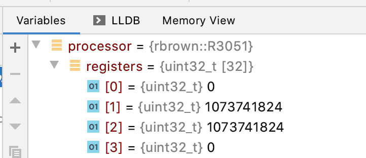
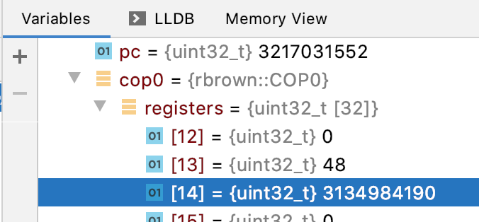

# Dynamic recompilation Part 5
## The Ultimate Romantic Comedy.

### Introduction
In this part we're going to start talking about exceptions that can
occur during the execution of MIPS instructions.

To begin with we'll discuss how exceptions are implemented in the
MIPS family of processors and talk a little about Coprocessors.

Then we're going to focus on the **ADD** instruction which, unlike its **ADDU** counterpart,
raises **Arithmetic Overflow** exceptions whenever Integer Overflow occurs.

To support exceptions within an instruction we're going to add support for Jumps and Labels
to our emitter to allow us to skip over portions of code.

### Recap
Last time we recompiled our first three instructions; **ADDU**, **SUB** and **ADDIU**. Our 
recompiler now looks something like

```c++
void Emit(EmitterX64& emitter, R3051& processor, uint32_t opcode) {
    switch (InstructionOp(opcode)) {
        case 0x00: switch(InstructionFunction(opcode)) {
                case 0x21: return EmitAddu(emitter, processor, opcode);
                case 0x23: return EmitSubu(emitter, processor, opcode);
                default:
                    break;
            }
        case 0x09: return EmitAddiu(emitter, processor, opcode);
        default:
            break;
    }
}
```

We investigated two approaches for loading and storing Guest Registers and outlined
some shortcomings of our simplistic approach and identified _Register Allocation_ techniques 
as something to follow up on.

In implementing **ADDIU** we encountered our first MIPS _I-Type_ instruction.

### Exceptions Actually
Under normal circumstances processors execute one instruction after another without 
much pause for thought. However, every once in a while something unexpected might 
happen and processors need a way to signal 
_"Wait a minute! Something weird happened!" to the outside observer._ 

Exceptions are how processors accomplish this, and they generally occur in one of three circumstances

1. while attempting to execute an instruction and something goes wrong like dividing by zero, or because the instruction is designed to cause an exception (the MIPS BREAK or SYSCALL instructions).
2. when something goes wrong trying to communicate with the outside world. This could be a bad Virtual to Physical Address translation or because the processor tried to write to read-only memory.
3. when an external device wants to interrupt the processor's normal operation to call some service routine. 

When an exception occurs some of the processor's state is saved 
(usually information about what the processor was doing when the exception occurred)
somewhere and program execution is usually transferred to an address in memory known 
to contain code that can handle exceptions.

Handling MIPS exceptions therefore requires more state management than we've seen 
so far in our simple **R3051** class. We have the 32 general purpose registers, and they're just that,
general purpose. They are not used to store information about the processor's state when
exceptions occur. So how do MIPS processors handle instructions? Through the use of Coprocessors.

The MIPS processors, being RISC processors, wanted to have a _small_ instruction set.
However, being small and elegant doesn't necessarily solve all worldly problems so the
designers decided to add support for not one, but **four** Coprocessors to make the processor extensible.
Coprocessor 1 was usually a floating point Coprocessor and the original Playstation used Coprocessor 2 
as its _Geometry Transformation Engine_ to help with graphics related calculations.

Coprocessor 0 however was reserved as the System Control Coprocessor. It has, again in 
broad brush strokes, two main tasks: Virtual Address translation (think of this as Memory Management)
and Exception Management.

Like the main processor it has thirty-two registers and a bare-bones implementation might look 
something like this

```c++
class COP0 {
public:
    COP0();
    [[nodiscard]] uint32_t ReadRegister(uint32_t) const;
    void WriteRegister(uint32_t, uint32_t);
private:
    uint32_t registers[32];
};
```

with the following additions to our **R3051** class

```c++
class R3051 {
private:
    uint32_t registers[32];
    uint32_t pc;
    COP0 cop0;
}
```

The other additional member here is called the _Program Counter_ or **PC** for short. 
We'll need it to be able to process exceptions correctly in a moment but its main job is 
to keep track of where the current instruction is in memory 

_Note: Intel processors call this the _Instruction Pointer_ which is perhaps a better name._

So far so good. But how does this help us handle exceptions?

Coprocessor 0's registers are not general purpose and the ones that are utilised
(about 16 of the available 32) have dedicated functions.

When the processor detects that an exception has occurred a sequence of events
takes place involving the following three Coprocessor 0 registers

- The **EPC** or _Exception Program Counter_ register is used to store the _Program Counter_ where the exception occurred.
- The **CAUSE** register is used to store what type of exception occurred. Like for example, **Arithmetic Overflow**.
- The **STATUS** register, which holds the current and two previous privilege and interrupt levels of the processor, is updated to reflect that the processor is now in privileged mode and not interruptable.

and finally the processor's Program Counter is changed to point to an address
that is known to hold exception handling code called an _Exception Vector_.

Let's add a method to our **COP0** class to do all of this

```c++
uint32_t COP0::EnterException(uint32_t code, uint32_t epc, uint32_t branch) {
    WriteRegisterMasked(SR, 0x0000003Fu, ReadRegister(SR) << 2u);
    WriteRegisterMasked(CAUSE, 0x8000007Cu, (branch << 31u) + ((code & 0x1Fu) << 2u));
    WriteRegister(EPC, epc);
    return BOOT_EXCEPTION_VECTOR;
}
```

We'll gloss over the **branch** parameter for now and assume that for the rest of this
article that it will always be zero.

We're also going to need a method that we can call from our recompiler to invoke the one above.
Something like

```c++
void EnterException(R3051* r3051, uint32_t code) {
    const uint32_t epc = ReadPC(r3051);
    const uint32_t pc = r3051->Cop0().EnterException(code, epc, 0u);
    WritePC(r3051, pc);
}
```

which makes a note of the current Program Counter and passes it to the **EnterException** method and
then updates the Program Counter to the returned Exception Vector. _This method assumes the recompiler
has correctly updated the Program Counter beforehand._

That should now enable us to move forward with the **ADD** instruction.

### Gotta Add Em All
The 32-bit quantities stored in the MIPS registers can be interpreted as 
either _signed_ or _unsigned_ quantities.

Arithmetic overflow under addition occurs for signed quantities in precisely two circumstances

1. When you add two signed positive numbers together and the result is negative.
2. When you add two signed negative numbers together and the result is positive.

The **ADD** instruction chooses to interpret the register contents as signed quantities which
means it can raise arithmetic overflow exceptions.

Let's add a function to help our interpreter know if overflow occurred

```c++
uint32_t OverflowAdd(uint32_t x, uint32_t y, uint32_t result);
```

and propose an implementation for the interpreted version of **ADD**

```c++
void InterpretAdd(R3051* r3051, uint32_t opcode) {
    const uint32_t s = ReadRegisterRs(r3051, opcode);
    const uint32_t t = ReadRegisterRt(r3051, opcode);
    const uint32_t result = s + t;
    if (OverflowAdd(s, t, result)) {
        EnterException(r3051, ARITHMETIC_OVERFLOW);
        return;
    }
    WriteRegisterRd(r3051, opcode, result);
}
```

This is an interesting development. We now have code that is executed conditionally
and our recompiler is going to have to do something similar.

What we want to achieve is something like

```c++
emitter.MovR64Imm64(RDX, processor.RegisterAddress(0));
emitter.MovR32Disp8(RAX, RDX, rs * size);
emitter.MovR32Disp8(RCX, RDX, rt * size);
emitter.AddR32R32(RAX, RCX);
// if (OverflowAdd()) {
CallInterpreterFunction(emitter, AddressOf(WritePC), processor, 0xBADC0FFE);
CallInterpreterFunction(emitter, AddressOf(EnterException), processor, ARITHMETIC_OVERFLOW);
emitter.MovR64R64(RSP, RBP);
emitter.PopR64(RBP);
emitter.Ret();
// }
emitter.MovDisp8R32(RDX, rd * size, RAX);
```


In the case of overflow we want to do a number of things.

Firstly, the **EnterException** method expects the processor's copy of the Program Counter to be up-to-date,
so we have to update it. For now, since we're not keeping track of the Program Counter ourselves, we write
back **0xBADC0FFE** as a placeholder. 

Secondly, we are going to exit the recompiled function in the event of an exception. The guest 
Program Counter will have changed as a result, and we want to start recompiling from a different 
location as a result. Therefore, we emit a copy of the function epilog after calling **EnterException** 
before returning.

_Note: In future there might be additional state besides the Program Counter that we
might want to synchronise to the processor before exiting from the recompiled block.
As a consequence, the approach outlined above with synchronisation code being emitted to
handle every potential exception might become unwieldy._

But how then do we do detect overflow? 

The good news is that Intel processors don't raise exceptions for Arithmetic Overflow and store
outcomes for arithmetic operations like Overflow in the **RFLAGS** register. Once we've done the Guest 
addition the Host Processor can tell us if overflow happened or not.

The other piece of good news is that Intel processors offer a family of instructions called 
_Conditional Jumps_ to allow us to skip over portions of recompiled code. There are two potentially 
useful candidates[^1]

```text
JNO rel8 Jump short if not overflow (OF=0).
JO  rel8 Jump short if overflow (OF=1).
```

using relative offsets, but we're going to go with the first form since we want 
to skip over the contents of the if-statement if overflow did not occur. In effect,

```c++
emitter.MovR64Imm64(RDX, processor.RegisterAddress(0));
emitter.MovR32Disp8(RAX, RDX, rs * size);
emitter.MovR32Disp8(RCX, RDX, rt * size);
emitter.AddR32R32(RAX, RCX);
emitter.Jno(SET_REGISTER)
CallInterpreterFunction(emitter, AddressOf(WritePC), processor, 0xBADC0FFE);
CallInterpreterFunction(emitter, AddressOf(EnterException), processor, ARITHMETIC_OVERFLOW);
emitter.MovR64R64(RSP, RBP);
emitter.PopR64(RBP);
emitter.Ret();
//SET_REGISTER
emitter.MovDisp8R32(RDX, rd * size, RAX);
```

But this now introduces a second problem. How do we know where **SET_REGISTER** is in relation to the Jump?

The simple answer is that we don't. We might want to add or remove instructions 
to the overflow handling path at a later date and this will affect the relative 
distance between the jump and its target.

To solve this problem we're going to have to borrow a concept from assemblers known as _labels_.

In normal assembly our code would look like

```asm
ADD EAX, ECX
JNO set_register
CALL WritePc
CALL EnterException
MOV RSP, RBP
POP RBP
RET
set_register:
MOV DWORD PTR [RDX + 8], EAX
```

and we would like to achieve something similar.

Let's introduce a **Label** concept to our **Emitter** class. First the **Label**

```c++
class Label {
public:
    explicit Label(uint64_t);
    [[nodiscard]] uint64_t Id() const;
    [[nodiscard]] size_t Position() const;
    [[nodiscard]] bool Bound() const;
    void Bind(size_t);
private:
    uint64_t id;
    size_t position;
    bool bound;
};
```

which has an **id**, the Label's **position** in the Emitter's buffer and **bound** which
indicates if the **position** has been correctly set or not. 

In the **Emitter** we add the following method

```c++
Label EmitterX64::NewLabel() {
    return static_cast<Label>(nextLabelId++);
}
```

which creates an unbound Label with a (mostly) unique id.

Once we have a label we would like to jump to it, so we introduce **Jno** method

```c++
void EmitterX64::Jno(const Label& label) {
    buffer.Bytes({ 0x71u, 0x00u });
    const size_t position = buffer.Position();
    if (label.Bound()) {
        FixUpCallSite(static_cast<CallSite>(position), label);
    } else {
        callSites[label.Id()].emplace_back(position);
    }
}
```

which does two things

1. Emits the jump instruction code (0x71) and an extra zero byte that will eventually
contain the relative location of the target. This zero needs to be fixed up later.

2. If the label has already been bound then the Jump (or call site) can be fixed up immediately. 
If not, the call site is added to the list of call sites for that label.

Then the **Bind** method to fix the position of the label

```c++
void EmitterX64::Bind(Label& label) {
    if (label.Bound()) {
        return;
    }
    label.Bind(buffer.Position());
    const uint64_t id = label.Id();
    for (const CallSite& site: callSites[id]) {
        FixUpCallSite(site, label);
    }
    callSites.erase(id);
}
```

which checks to see if the Label has already been bound. If not, then it's bound to the 
current buffer position and all the call sites we made a note of in the Jump method are fixed up.

The **FixUpCallSite** method looks like

```c++
void EmitterX64::FixUpCallSite(const CallSite& site, const Label& label) {
    buffer.Byte(site.Position() - 1u, label.Position() - site.Position());
}
```

Which fills in the zero byte with the position of the label relative to the position
to the call site.

_Note: We only support 8-bit signed displacements here. This is quite a 
big limitation, and we need to be careful. It should be noted Intel processors also 
support 32-bit signed displacement jumps._

We can now put this all together to get

```c++
void EmitAdd(EmitterX64& emitter, R3051& processor, uint32_t opcode) {
    // Rd = Rs + Rt
    const uint32_t rs = InstructionRs(opcode);
    const uint32_t rt = InstructionRt(opcode);
    const uint32_t rd = InstructionRd(opcode);
    constexpr size_t size = sizeof(uint32_t);
    Label setRegister = emitter.NewLabel();
    emitter.MovR64Imm64(RDX, processor.RegisterAddress(0));
    emitter.MovR32Disp8(RAX, RDX, rs * size);
    emitter.MovR32Disp8(RCX, RDX, rt * size);
    emitter.AddR32R32(RAX, RCX);
    emitter.Jno(setRegister);
    CallInterpreterFunction(emitter, AddressOf(WritePC), processor, 0xBADC0FFE);
    CallInterpreterFunction(emitter, AddressOf(EnterException), processor, ARITHMETIC_OVERFLOW);
    emitter.MovR64R64(RSP, RBP);
    emitter.PopR64(RBP);
    emitter.Ret();
    emitter.Bind(setRegister);
    emitter.MovDisp8R32(RDX, rd * size, RAX);
}
```

Putting this to the test we have

```c++
R3051 processor;
processor.WriteRegister(1, 0x40000000);
processor.WriteRegister(2, 0x40000000);
const uint32_t opcode = 0x00221820u; // ADD R3, R1, R2

CodeBuffer buffer(1024);

EmitterX64 emitter(buffer);
emitter.PushR64(RBP);
emitter.MovR64R64(RBP, RSP);

EmitAdd(emitter, processor, opcode)
  
emitter.MovR64R64(RSP, RBP);
emitter.PopR64(RBP);
emitter.Ret();

buffer.Protect();
buffer.Call();
```

and upon execution we see that **R3** is not written to



and that the Coprocessor 0 registers related to exception handling have been written to.



###  Conclusion
In this article we discussed MIPS exception handling; detecting arithmetic overflow 
under addition and how to handle jumps with labels. 

Finally, we implemented the **ADD** instruction.

In the next part, we'll finally try to communicate with the outside world 
for the first time by implementing the **SW** or Store Word instruction.

### References
Intel Software Developer's Manual